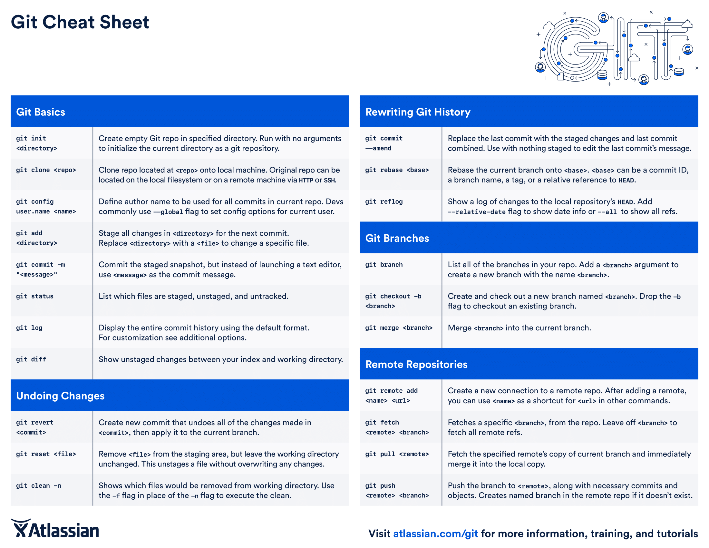
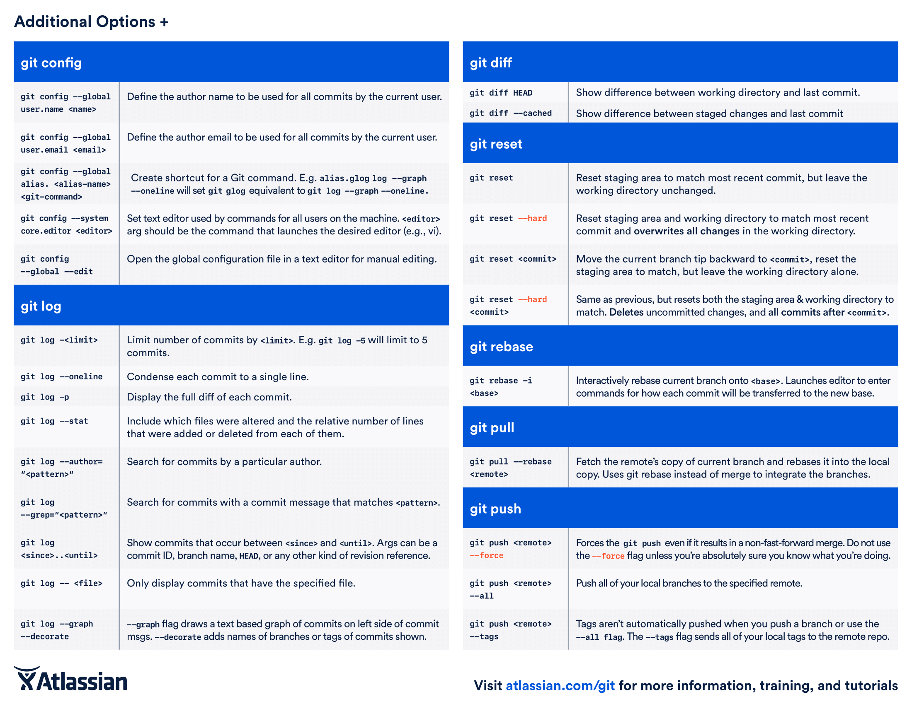
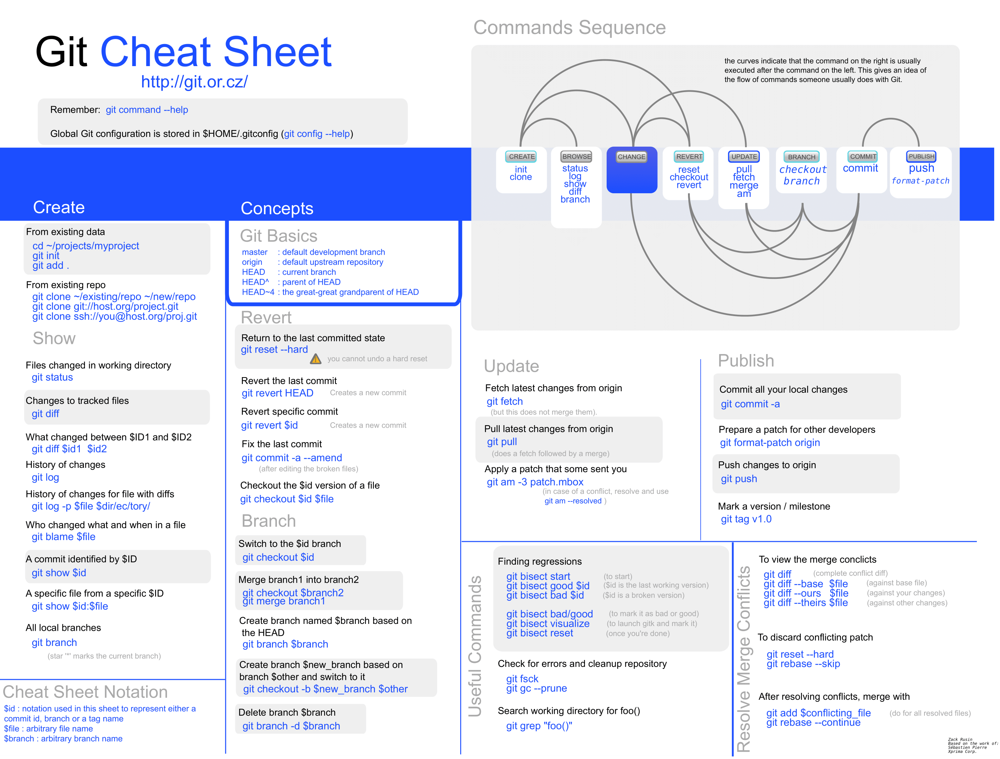
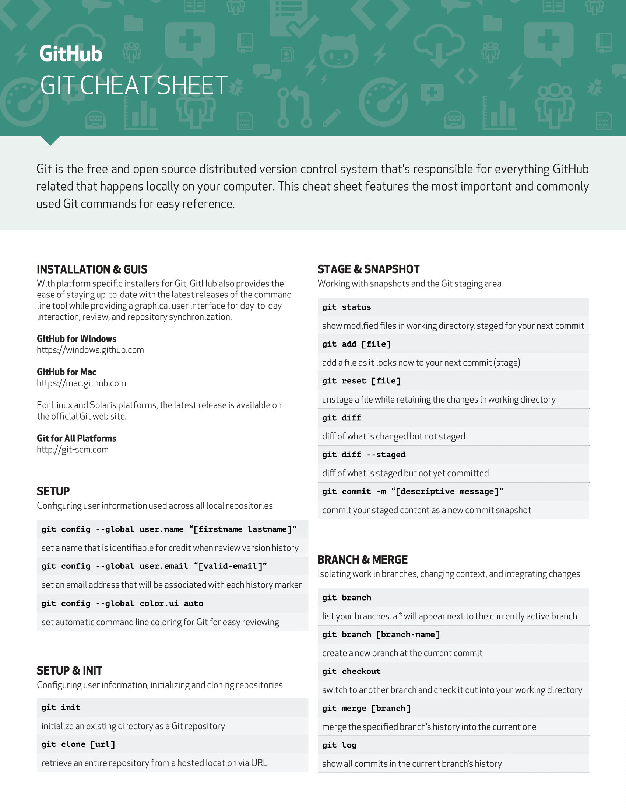
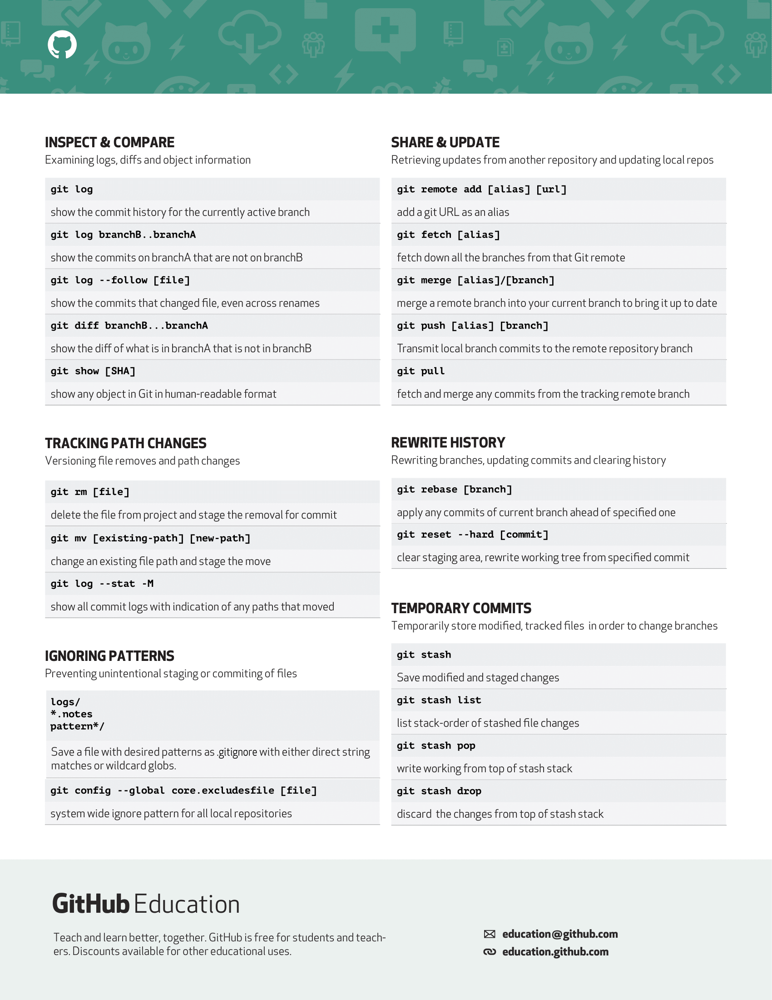

# Git-Cheetsheet
#### Differnet Cheatsheets for Git.
#### You can contribute other git CheatSheet if you have.
#### Thanks to All The Makers of This Cheat-Sheet 🤝❤️.

# Atlassian Git Cheat Sheet 🌟
### pdf : https://www.atlassian.com/git/tutorials/atlassian-git-cheatsheet
 

 

# Git Cheatsheet Official 🌟
### pdf: http://git.or.cz/
 

 

# Github Education 🌟
### pdf : https://education.github.com/git-cheat-sheet-education.pdf
 

 

## Thank you For Visiting ❤️

## Feel Free To Give Star ⭐ To This Repository.
